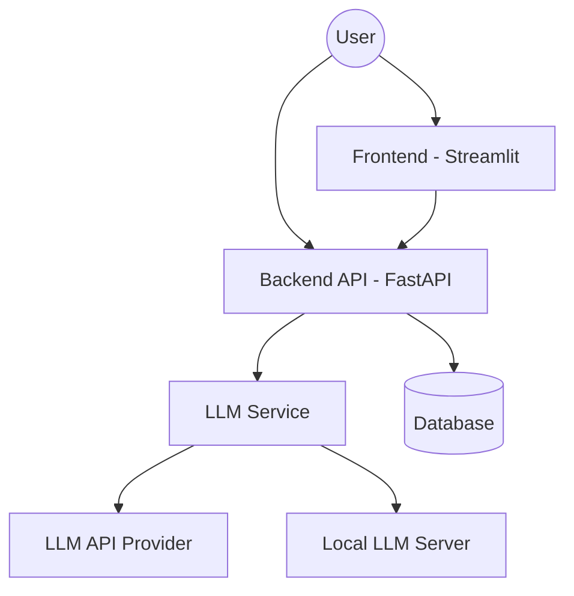

# ML System Design Doc - [RU]
## Дизайн ML системы - FeedbackFirst MVP

### 1. Цели и предпосылки
#### 1.1. Зачем идем в разработку продукта?

- **Бизнес-цель проекта** \
    Создание системы для проведения пробных собеседований, которая помогает кандидатам подготовиться к реальным интервью в области Machine Learning. Система предоставляет персонализированную обратную связь и рекомендации, помогая пользователям оценить свои сильные и слабые стороны и улучшить навыки с помощью технологий больших языковых моделей (LLM) и Retrieval-Augmented Generation (RAG).

- **Почему станет лучше с использованием ML**
    - **Персонализированная обратная связь:** LLM/RAG адаптируют рекомендации по подготовке под конкретного пользователя на основе его ответов, обеспечивая высокую точность и контекстуальную релевантность.
    - **Автоматизация процесса:** Исключается необходимость участия HR-специалистов на этапе подготовки, что повышает доступность и частоту тренировок.
    - **Отслеживание прогресса:** Аналитика на основе ML позволяет оценивать динамику навыков пользователя, предлагая конкретные пути для их улучшения.
    - **Объективный анализ ответов:** система анализирует текстовые и голосовые ответы, выявляя ключевые аспекты — структура, логика, эмоциональная окраска.

- **Что будем считать успехом итерации с точки зрения бизнеса**
    - **Точность обратной связи:** Высокая оценка полезности рекомендаций пользователями или через технические метрики (прототип).
    - **Повышение успешности на реальных собеседованиях:** Увеличение числа пользователей, которые успешно проходят интервью после тренировки с системой (пилот).
    - **Снижение стресса перед собеседованиями:** Положительные изменения в уровне уверенности пользователей, подтвержденные опросами (пилот).
    - **Уровень вовлеченности:** Повторное использование системы и выполнение пользователями рекомендаций, что свидетельствует о доверии и полезности инструмента (пилот).

#### 1.2. Бизнес-требования и ограничения
- **Краткое описание бизнес-требований**
    - **Анализ речевой и текстовой информации** \
    Система должна анализировать текстовые и голосовые ответы кандидатов, оценивая их содержательность, структуру, логику, эмоциональную окраску и соответствие требованиям позиции.

    - **Персонализированная обратная связь** \
    На основе анализа система предоставляет детальную обратную связь о сильных и слабых сторонах пользователя.

    - **Интерактивные рекомендации** \
    Система должна выдавать индивидуальные рекомендации и тренировочные задания для повышения уровня подготовки.

    - **Поддержка различных типов собеседований** \
    Адаптация под специфические требования интервью для разных ролей и уровней опыта.

    - **Конфиденциальность данных** \
    Система должна гарантировать защиту персональной информации пользователей и их результатов.

- **Бизнес-ограничения**
    - **Ограниченные ресурсы** \
    В начальной стадии требуется минимизация затрат на разработку и внедрение, фокус на ключевой функциональности.

    - **Сроки разработки** \
    Разработка MVP должна быть завершена в рамках четко определенного времени.

- **Что мы ожидаем от конкретной итерации** \
    MVP должен включать следующие функции:
    - Базовый диалоговый интерфейс в виде веб-приложения или telegram бота.
    - Анализ текстовых ответов пользователя, сравнение их с эталонными ответами, предоставление обратной связи.
    - Базовые рекомендации по изучению различных тем для улучшения на основе анализа текстовых ответов.
    - Тестирование системы на ограниченной группе пользователей.
    - Сбор первых данных о пользовательском опыте и вовлеченности.

- **Описание бизнес-процесса пилота, насколько это возможно - как именно мы будем использовать модель в существующем бизнес-процессе?** \
    На данный момент система не будет встраиваться ни в какие бизнес процессы. При успешной разработке прототипа системы будет запущен пилот - открыт доступ для всех пользователей, когда каждый сможет оставить свой фидбек, на основе которого можно будет судить об успешности пилота и возможных сценариях улучшения.

- **Успешный пилот: критерии успеха и дальнейшие шаги**
    Критерии успеха пилота:

    - **Точность обратной связи** \
    Положительные отзывы от пользователей о точности и полезности предоставленных рекомендаций.

    - **Уровень вовлеченности** \
    Процент пользователей, которые прошли повторное собеседование и применили рекомендации.

    - **Успех на реальных собеседованиях** \
    Повышение процента пользователей, которые успешно прошли реальные интервью.

    - **Снижение стресса** \
    Измерение изменений в уровне уверенности через опросы.

    Дальнейшие шаги:
    - **Расширение функциональности** \
    Внедрение поддержки голосовых данных, улучшение качества персонализированных рекомендаций с использованием RAG.
    - **Масштабирование** \
    Добавление новых профессиональных сфер и типов собеседований.
    - **Улучшение аналитики** \
    Разработка более продвинутой системы отслеживания прогресса и метрик обучения.

#### 1.3. Что входит в скоуп проекта/итерации, что не входит

- **На закрытие каких БТ подписываемся в данной итерации** \
    - **Базовый диалог через LLM** \
    Ведение текстового диалога с пользователем: LLM задает вопросы, пользователь отвечает.
    - **Использование RAG для извлечения вопросов** \
    Хранение базы данных вопросов и эталонных ответов. Вопросы и ответы будут получены парсингом с интернет-ресурсов, генераций с помощью LLM моделей, а также из личного опыта.
    Поиск наиболее релевантного вопроса для следующего шага на основе темы и прогресса пользователя.
    - **Анализ ответов** \
    Семантический анализ ответа пользователя: сравнение с эталонными ответами из базы.
    - **Базовая оценка качества ответа: корректность, полнота, структура.**
    - **Выдача простых подсказок по улучшению ответа.**
    Предложение дополнительных вопросов для закрепления материала.
    - **Реализация базового функционала веб-интерфейса**: отправка сообщений, прием ответов, передача данных на сервер для анализа.

- **Что не будет закрыто**
    - **Анализ голосовых данных** \
    Обработка и анализ аудиоответов, включая эмоциональную окраску или выявление волнения, не реализуются на этапе MVP.
    - **Окончательный вид веб-интерфейса**
    - **Поддержка различных профессиональных сфер** \
    Система будет заточена под общие ML-интервью, без адаптации под другие профессиональные роли.
    - **Продвинутая аналитика прогресса** \
    В текущей версии не будут реализованы детальные дашборды для отслеживания динамики навыков пользователя.

- **Описание результата с точки зрения качества кода и воспроизводимости решения**
    - **Качество кода** \
    Код будет документирован, обеспечивая базовый уровень читаемости и понятности.
    Применение стандартов кодирования (например, PEP 8 для Python).
    - **Воспроизводимость**
        - Возможность повторного запуска MVP-системы на основе инструкции и контейнеризации (например, Docker).
        - Подготовка скриптов для автоматического развертывания среды и загрузки необходимых данных.
    - **Простая интеграция** \
    API для взаимодействия фронтенда с бэкендом будет доступен с базовой документацией.

- **Описание планируемого технического долга (что оставляем для дальнейшей продуктивизации)**
    - Обработка голосовых данных: интеграция и настройка анализа аудиоответов для определения эмоционального состояния кандидата.
    - Оптимизация модели и производительности: текущая версия может работать медленнее на больших объемах данных, что потребует последующей оптимизации.
    - Расширенная аналитика и дашборды: будет добавлена в следующей итерации для предоставления более детальной обратной связи и визуализации прогресса.
    - Тестирование и качество кода: увеличение покрытия тестами и проведение нагрузочного тестирования.
    - Оптимизация и рефакторинг некоторых модулей для повышения производительности и упрощения поддержки.

#### 1.4. Предпосылки решения

- **Описание всех общих предпосылок решения, используемых в системе – с обоснованием от запроса бизнеса: какие блоки данных используем, горизонт прогноза, гранулярность модели, и др.** \

    - **Входные данные:**
        - Текстовые данные о карьерном опыте пользователя
        - Данные о вакансии, к собеседованию на которую человек хочет подготовиться (если есть), если нет, то текстовые данные о том, какие темы в хочет затронуть в интервью пользователь.
        - Промпты для LLM (для обеспечения качественной генерации и структурирования контента)
        - База с популярными вопросами с собеседований, а так же вопросов по определенным темам с ответами на них.

    - **Требования к LLM:**
        - Способность к структурированию и анализу текста
        - Понимание профессионального контекста и терминологии
        - Генерация релевантных формулировок и объяснений
        - Подбор LLM будет осуществляться по ее результатах на существующих бенчмарках, а так же результатах сравнений на LLM Arena. Будет выбрана лучшая модель из доступных.

    - **Технические ограничения:**
        - Время генерации вопроса и проверки ответа на него < 5-10 секунд
        - Обработка текста на русском языке
        - Ограничения на токены и запросы к LLM API или размер LLM для локального инференса

#### 2.1. Постановка задачи

Тип задачи: разработка системы для ведения диалога с пользователем на основе LLM в Telegram-боте с использованием Retrieval-Augmented Generation (RAG) для работы с базой вопросов и ответов.

Основные технические компоненты:
- Ведение диалога с пользователем (LLM)
    - Генерация вопросов из базы данных по темам собеседований.
    - Анализ текстовых ответов пользователя и предоставление обратной связи.
- Хранилище вопросов и ответов (RAG)
    - Использование векторного поиска (например, FAISS или Elasticsearch) для поиска наиболее подходящих вопросов.
    - Интеграция с LLM для формирования дополнительных рекомендаций и уточняющих вопросов на основе контекста.
- Анализ ответов пользователя (проверка качества ответов и предоставление обратной связи.)
    - Сравнение ответа пользователя с эталонным (семантическое сходство, логика, структура).
    - Оценка полноты ответа и выявление недочетов.
    - Выявление ключевых сильных и слабых сторон ответа.
- Рекомендации по улучшению (на основе анализа ответа пользователь получает персонализированные рекомендации.)
    - Подсказки по структуре ответа, улучшению логики или полноты.
    - Предложение дополнительных вопросов или тренировочных заданий.
- Интеграция с Telegram-ботом или другим веб-интерфейсом
    - Обеспечение интерактивного и удобного взаимодействия с пользователем.
    - Отправка вопросов, получение и анализ ответов, предоставление рекомендаций в режиме реального времени.

#### 2.2. Блок-схема решения

#### 2.3. Этапы решения задачи Data Scientist

**Этап 1 – Подготовка данных**
1. Загрузка базы вопросов и ответов.
2. Очистка, аннотирование и нормализация текстов.
3. Векторизация вопросов и ответов с использованием моделей генерации эмбеддингов (например, Sentence Transformers).
4. Сохранение эмбеддингов в векторной базе данных (например, FAISS или Chroma DB).
**На выходе:** набор векторных представлений вопросов и ответов, готовых для семантического поиска.

---

### Этап 2 – Обработка запроса пользователя
1. Получение ответа пользователя на заданный вопрос.
2. Предобработка текста ответа пользователя.
3. Векторизация ответа с использованием той же модели, что и для вопросов и ответов.
**На выходе:** эмбеддинг ответа пользователя.

---

### Этап 3 – Семантический поиск и анализ
1. Сравнение эмбеддинга ответа пользователя с эмбеддингами эталонных ответов.
2. Определение схожести (например, с помощью косинусного сходства). Нужно для того, чтобы ответ пользователя был наиболее близко к эталонному ответу определенного вопроса. Если он будет близок к ответу на другой вопрос, то это стоит отметить как отдаление от темы.
3. Выделение ключевых различий и пробелов в ответе пользователя с помощью LLM.
4. Формирование списка рекомендаций и дополнений для улучшения ответа с помощью LLM.
**На выходе:** анализ ответа пользователя с подсветкой ошибок, рекомендациями и примерами из эталонного ответа.

---

### Этап 4 – Обратная связь пользователю (на этапе MVP реализуется 1 пункт*)
1. Отображение результатов анализа в удобном формате:
   - Подсветка недостатков (где пользователь ошибся или упустил).
   - Дополнения к ответу (что можно улучшить или уточнить).
   - Примеры из эталонного ответа для контекста.
2. Возможность для пользователя уточнить или изменить ответ.
**На выходе:** интерактивная обратная связь для обучения. \

---

### Этап 5 – Адаптация модели (на этапе MVP не реализуется)
1. Сбор данных о том, как пользователи отвечают на вопросы:
   - Точность ответов.
   - Часто упускаемые темы.
2. Настройка модели под специфику реальных данных:
   - Добавление новых примеров.
   - Улучшение векторизации или алгоритмов поиска.
3. Тестирование системы на новых данных и обновление модели.
**На выходе:** улучшенная версия модели с учетом пользовательского опыта.

---

### Этап 6 – Мониторинг и улучшение (на этапе MVP не реализуется)
1. Отслеживание ключевых метрик:
   - Точность подсказок.
   - Доля исправленных ответов.
   - Удовлетворенность пользователей.
2. Обновление базы вопросов и ответов.
3. Внедрение улучшений на основе полученных данных.
**На выходе:** регулярное обновление системы для повышения качества обучения.

### 3. Подготовка пилота

#### 3.1. Способ оценки пилота
Для оценки пилота учебного проекта будет применен упрощенный дизайн эксперимента, направленный на сбор данных о точности и полезности системы для небольшой группы пользователей. Основные аспекты оценки:

- **Группы участников**:
  - До 100 пользователей, использующих систему FeedbackFirst для подготовки к собеседованиям.

- **Методология**:
  - Сравнение результатов использования системы до и после (метод «до и после»).
  - Сбор обратной связи через опросы и анкетирование.

- **Данные для анализа**:
  - Оценки точности и полезности рекомендаций (опросы).
  - Результаты выполнения тренировочных задач (успех в выполнении рекомендаций).
  - Субъективная уверенность пользователей перед собеседованиями (опросы).

- **Инструменты**:
  - Сбор данных через веб-интерфейс или Telegram-бот.
  - Ручной сбор обратной связи (анкеты и интервью).

**Результат:**
Набор данных и качественных отзывов, необходимых для оценки точности системы и пользовательского опыта.

---

#### 3.2. Что считаем успешным пилотом
Для формализации успеха пилота в учебном проекте определены следующие метрики:

- **Точность обратной связи**:
  - Уровень полезности рекомендаций ≥ 80% положительных отзывов.
  - Средний рейтинг точности обратной связи ≥ 4 из 5.

- **Уровень вовлеченности пользователей**:
  - Минимум 40% пользователей вернулись к системе повторно.
  - Доля пользователей, которые выполнили рекомендации и задачи ≥ 30%.

- **Успех на тренировочных заданиях**:
  - Увеличение качества ответов пользователей на тренировочные вопросы (измеряется разницей в оценках до и после тренировок).

- **Снижение стресса**:
  - Положительная динамика в уровне уверенности пользователей (по результатам опросов) ≥ 70% участников отметили снижение стресса.

**Результат:**
Успешным пилотом считается достижение хотя бы 3 из 4 ключевых критериев.

---

#### 3.3. Подготовка пилота
Подготовка пилота будет включать следующие шаги:

1. **Базовая оценка вычислительных ресурсов**:
   - Оценка времени выполнения запросов на ограниченной группе участников (до 100 человек).
   - Проверка времени ответа LLM и базовой производительности системы на тестовых данных.

2. **Параметры пилота**:
   - Ограничение до 100 участников из учебной аудитории (например, студентов, начинающих специалистов в ML).
   - Продолжительность пилота: 2-3 недели.
   - Фокус на анализ текстовых данных (без обработки голосовых данных).

3. **Сбор пользовательской обратной связи**:
   - Разработка анкет для оценки полезности, точности рекомендаций и уровня стресса.
   - Организация интервью с 5-10 пользователями для получения качественных данных.

4. **Мониторинг и отчет**:
   - Отслеживание основных метрик: вовлеченности, точности обратной связи и улучшений в ответах.
   - Подготовка итогового отчета по результатам пилота с рекомендациями для дальнейших шагов.

**Результат:**
Подготовленная система и методология оценки для учебного пилота, позволяющая собрать данные и улучшить систему на основе отзывов.

---

### 4. Внедрение для production систем

Для учебного проекта в текущем виде большинство элементов могут быть реализованы в рамках пилота и тестирования. Однако, если проект будет перенесен в продакшн, следующие аспекты должны быть учтены.

#### 4.1. Архитектура решения
- **Сервисы**:
    - **Frontend (веб-приложение или Telegram-бот)**: взаимодействие с пользователем через диалоговые окна, отправка/получение сообщений, обработка запросов.
    - **Backend**: сервис, отвечающий за обработку текста, взаимодействие с LLM, анализ ответов, генерация рекомендаций, а также выполнение семантического поиска с помощью RAG.
    - **База данных с вопросами и ответами**: хранилище, поддерживающее операции поиска и обновления векторных представлений.
    - **API-сервис**: для связи между фронтендом, бэкендом и базой данных.

- **API**:
    - **Frontend → Backend**: API для отправки запросов и получения ответов от модели, а также для получения рекомендаций.
    - **Backend → Database**: API для взаимодействия с хранилищем вопросов и ответов, выполнения семантического поиска и получения информации.
    - **Backend → LLM API**: запросы к внешней модели (например, OpenAI GPT) для генерации рекомендаций и анализа текста.

**Блок-схема**:
    #TODO - Блок-схема архитектуры решения.

---

#### 4.2. Описание инфраструктуры и масштабируемости
- **Инфраструктура**:
    - **Облачные решения** для хостинга сервисов. Выбор зависит от доступных инструментов и стоимости.
    - **Модели LLM**, доступные по API или доступные для размещения на облачных серверах с возможностью масштабирования под нагрузку.
    - **Масштабируемость**:
      - Использование контейнеризации (Docker) для всех компонентов системы для обеспечения гибкости в развертывании и масштабировании.
      - Поддержка горизонтального масштабирования для обработки большего числа запросов одновременно, с автоматической балансировкой нагрузки.

- **Плюсы и минусы выбора**:
    - **Плюсы**:
      - Гибкость в масштабировании и снижении нагрузки на серверы.
      - Упрощенная настройка и обслуживание через использование облачных решений и контейнеризации.
    - **Минусы**:
      - Зависимость от облачных провайдеров и потенциальная нестабильность цен.
      - Высокие затраты на облачные вычисления при масштабировании.

- **Почему финальный выбор лучше других альтернатив**:
    - Облачные решения обеспечивают необходимую гибкость и масштабируемость, что делает их оптимальным вариантом для разворачивания модели с потенциальным увеличением пользователей и нагрузки.

---

#### 4.3. Требования к работе системы
- **SLA (Service Level Agreement)**:
    - **Время отклика**: Максимальное время ответа на запросы от пользователей не должно превышать 5-10 секунд для всех сервисов.
    - **Доступность**: Система должна быть доступна 99% времени.

- **Пропускная способность и задержка**:
    - Пропускная способность: Система должна поддерживать обработку до 500 запросов одновременно при запуске в продакшн.
    - Задержка: Для обеспечения качества взаимодействия с пользователем задержка не должна превышать 3 секунд на этапе анализа и генерации ответа.

---

#### 4.4. Безопасность системы
- **Потенциальная уязвимость системы**:
    - **XSS и SQL инъекции**: необходимость защиты от атак на фронтенде и в API.
    - **Уязвимости в LLM**: хотя данные для обучения могут быть отфильтрованы, необходимо следить за возможными небезопасными генерациями текстов и инъекциями в ответах пользователя.

---

#### 4.5. Безопасность данных
- Если необходимо хранить данные (например, результаты тестов или взаимодействий с приложением), можно использовать локальное хранилище на сервере или облачные решения с базовыми мерами безопасности.
- Важно, чтобы эти данные хранились в анонимизированном виде и использовались только для целей тестирования и демонстрации.

---

#### 4.6. Издержки
- **Расчетные издержки на работу системы в месяц**:
    - **Облачные вычисления**:
      Примерная стоимость использования облачных серверов для хостинга моделей и хранения данных может сильно разниться, но возможно найти варианты с ценой <$100
    - **API-запросы**:
      Зависит от количества запросов и выбранного облачного провайдера (например, $0.03-$0.10 за 1000 токенов в API-запросе LLM модели).
    - **Дополнительные расходы**:
      Разработка и поддержка системы, заработная плата разработчиков и специалистов.

---

#### 4.7. Integration points
- **Методы API и взаимодействие между сервисами**:
    - API для взаимодействия между фронтендом и бэкендом.
    - API для работы с LLM (в случае использования внешних сервисов).
    - Векторный поиск через API (например, для использования FAISS).
    - Логирование и мониторинг через системы мониторинга (например, Grafana).

---

#### 4.8. Риски
- **Описание рисков и неопределенностей**:
    - **Масштабирование**: при резком увеличении числа пользователей возможно ухудшение производительности системы. Необходимо заранее продумать методы масштабирования.
    - **Нагрузочные пики**: в периоды высокой активности система может испытывать перегрузки. Нужно подготовить план действий по авто-масштабированию.
    - **Качество данных**: качество ответов и рекомендаций сильно зависит от качества эталонных ответов и их количества.

